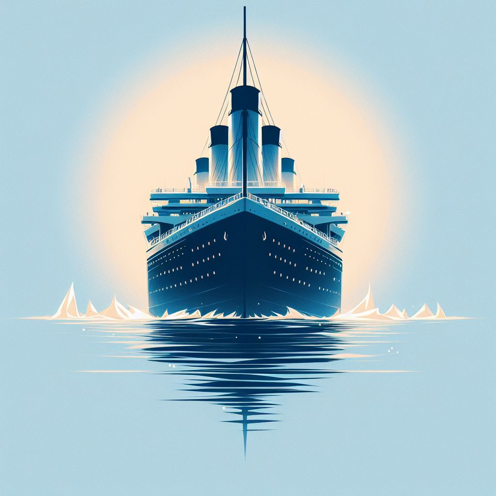

  

<h3 align="center">Titanic Passenger Survivability PredicitonProject</h3>

## 🧐 About 
In this final project, the goal is to build a machine-learning model and dashboard for the Titanic Survival Prediction Model based on some parameters. The Dashboard will be built in Streamlit and the model will be using random forest.

## 💭 How it works 
### Data Exploration and Cleaning
- Load the dataset and explore its structure.
- Clean the data by handling missing values, interpolating data, and removing outliers.
- Perform feature engineering if needed.

### Exploratory Data Analysis (EDA)
- Visualize the distribution of Titanic Passenger parameters/features.
- Understand the relationships between different features.
- Analyze statistical summaries, visualizations, and correlations.

### Model Building
- Use machine learning algorithms (e.g., Random Forest, XGBoost, KNN, Logistic Regression) to predict Passenger Survivability.
- Train the models on a training set and evaluate them on a validation set.

### Model Evaluation
- Assess model performance using metrics such as accuracy, confusion matrices, and classification reports.
- Compare different algorithms to select the most suitable one.

### Streamlit Dashboard
- Create a Streamlit dashboard for an interactive user interface.
- Allow users to input new data, and the trained model predicts Passenger Survivability.
- Integrate visualizations, including count plots and heatmaps, into the Streamlit app.

## ⚙️ How Its Build 
### Library
- pandas: [pandas](https://pandas.pydata.org/)
- sklearn: [scikit-learn](https://scikit-learn.org/)
- matplotlib: [matplotlib](https://matplotlib.org/)
- seaborn: [seaborn](https://seaborn.pydata.org/)
- numpy: [numpy](https://numpy.org/)

### Dataset
[Titanic Dataset](https://www.kaggle.com/competitions/titanic)

## 🙏 Conclusion 
- Summarize findings and insights gained from the data.
- Discuss recommendations or further steps, such as refining the model, exploring additional features, or improving data quality.

<!---
your comment goes here
and here
'''https://www.kaggle.com/datasets/adityakadiwal/water-potability'''
-->

